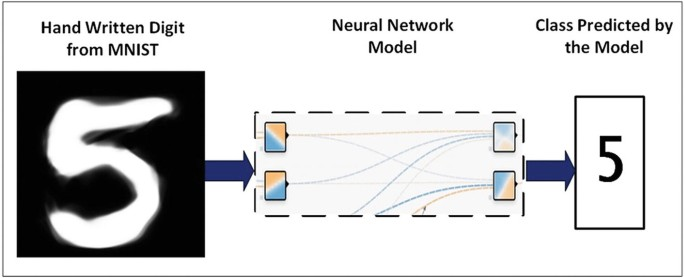
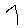
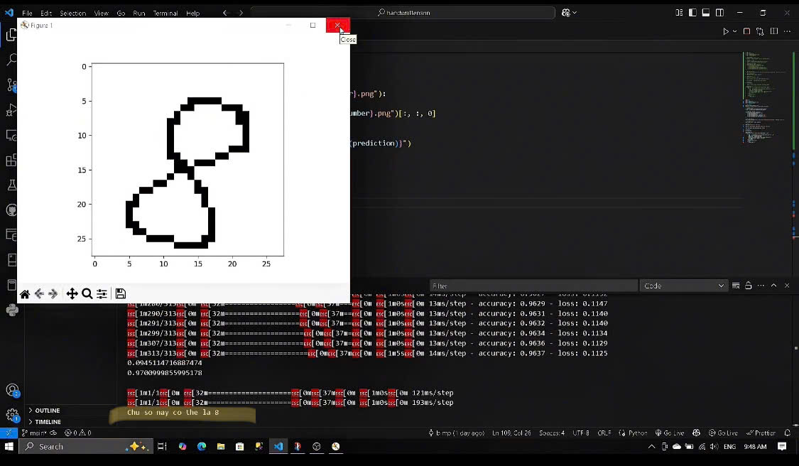

# 🧠 Nhận Dạng Chữ Số Viết Tay Sử Dụng Mạng Nơ-ron Nhân Tạo (ANN)

## 🔍 Giới thiệu  
- Ứng dụng sử dụng mạng nơ-ron nhân tạo (ANN) để phân loại chữ số viết tay từ tập dữ liệu MNIST.  
- Ứng dụng trong nhập liệu tự động, nhận diện số trong hình ảnh tài liệu, giáo dục và ngân hàng.  

## 🏗️ Hệ thống  


### 📂 Cấu trúc dự án  
- 📦 **HandwrittenDigitRecognition**  
  - 📂 **dataset** – Tập dữ liệu chữ số viết tay  
    - 📂 **mnist** – Dữ liệu huấn luyện và kiểm tra  
  - 📂 **models**  
    - 📜 **Handwritten.model.keras** – Mô hình ANN đã huấn luyện  
  - 📂 **scripts**  
    - 📝 **train.py** – Huấn luyện mô hình ANN  

  - 📂 **digits**  
    - 🖼️ **digit1.png** – Ảnh chữ số viết tay cần nhận dạng  
    - 🖼️ **digit2.png**  
    - 🖼️ **vidu.png** – Ảnh ví dụ chữ số đầu vào  
    - 🖼️ **kq8.png** – Kết quả nhận dạng số 8  
  - 📝 **run.py** – Chạy chương trình nhận dạng  


## 🛠️ Công nghệ sử dụng  

### 📡 Phần cứng  
- Chạy qua CPU
- Máy tính có GPU để tăng tốc huấn luyện mô hình (tùy chọn).  

### 🖥️ Phần mềm  
- **Python** – Ngôn ngữ lập trình chính.  
- **TensorFlow/Keras** – Xây dựng và huấn luyện mạng nơ-ron nhân tạo.  
- **OpenCV** – Xử lý ảnh trước khi đưa vào mô hình.  
- **NumPy, Matplotlib** – Hỗ trợ tiền xử lý và hiển thị dữ liệu.  

## 🧮 Thuật toán  

### 🔹 Mô hình ANN  
- **Lớp đầu vào** – Ảnh chữ số 28x28 pixel.  
- **Lớp ẩn** – 2 lớp Dense 128 neuron, hàm kích hoạt ReLU.  
- **Lớp đầu ra** – 10 neuron, hàm softmax, biểu diễn số 0-9.  

### 🔹 Tiền xử lý ảnh  
- Chuyển ảnh sang mức xám và chuẩn hóa về `[0,1]`.  
- Chuyển đổi ảnh thành mảng numpy để đưa vào mô hình.  

### 🔹 Huấn luyện mô hình  
- **Tập dữ liệu** – MNIST (60.000 ảnh huấn luyện, 10.000 ảnh kiểm tra).  
- **Hàm mất mát** – `sparse_categorical_crossentropy`.  
- **Bộ tối ưu hóa** – `adam`.  
- **Đánh giá độ chính xác trên tập kiểm tra**.  

## 🚀 Hướng dẫn cài đặt và chạy  
### lưu ý! khi tải mô hình về và chạy, dataset phải được đặt tên tệp là "digits" và tên các ảnh trong tệp phải đặt là "digit(số thứ tự ảnh đã tải vào).png"
### 1️⃣ Cài đặt môi trường  
Chạy lệnh sau để cài đặt các thư viện cần thiết:  
```bash
pip install tensorflow opencv-python numpy matplotlib


## 🚀 Hướng dẫn cài đặt và chạy

### 1️⃣ Cài đặt môi trường:
```bash
pip install tensorflow opencv-python numpy matplotlib
```

### 2️⃣ Huấn luyện mô hình:
```bash
python scripts/train_model.py
```

### 3️⃣ Nhận dạng chữ số:
```bash
python scripts/digit.py --image digits/digit1.png
```

---


### 1️⃣ Nhập ảnh chữ số:
- 


- Đặt ảnh vào thư mục `digits` và cập nhật đường dẫn trong mã nguồn.

### 2️⃣ Xem kết quả:
- Kết quả nhận dạng hiển thị trên terminal hoặc bằng hình ảnh.



